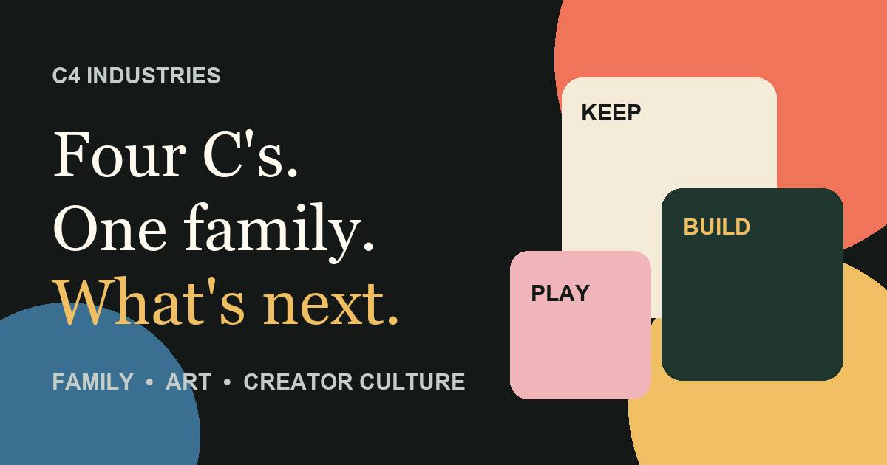

# C4 Industries Public Website

C4 Industries is a family-built creative studio with Bronx roots. The public site brings together printable keepsakes, original art, and creator-focused experiments.

**Live site:** https://jasonlugo85.github.io/c4-industries-public/  
**Storefront:** https://payhip.com/C4Industries

## Design direction

The site is built around an editorial print-studio aesthetic rather than a generic ecommerce template.

- Live products use real product imagery.
- Studio studies look like studio studies: notebook marks, block-print texture, graph paper, rough ink, and layout notes.
- Brand graphics stay simple so they do not compete with the work.
- Research, prototypes, and visual studies are kept separate from products that are actually for sale.

See docs/art-direction.md for the working visual standard.

## Repository structure

- index.html — brand overview and primary discovery page
- family-keepsakes.html — keepsake category page
- letters-to-my-future-family.html — dedicated product landing page
- original-art.html — live art products and separate studio studies
- creator-lab.html — research and prototype work
- assets/brand — logo, favicon, and social card
- assets/products — real product preview media
- assets/studio — original editorial studies
- assets/css — site styles
- assets/js — site behavior
- docs — art direction and provenance notes

## Asset policy

Customer-facing product media and studio exploration are deliberately separated.

- assets/products contains real product previews sourced from C4's live product listings.
- assets/studio contains original C4 editorial studies used to communicate work in progress.
- assets/brand contains the logo mark, favicon, and social-sharing artwork.

No synthetic person is used to imply a customer, founder, testimonial, or product owner. No concept image is presented as a finished product.

See docs/asset-provenance.md for source notes.

## Technology

The public site intentionally has a small footprint:

- semantic HTML
- custom CSS
- minimal vanilla JavaScript
- static hosting on GitHub Pages
- no frontend framework
- no paid site-builder dependency

## Commerce

Checkout and digital delivery remain on Payhip. Links from the public site include UTM parameters so C4 can distinguish website traffic from other storefront sources.

The public site does not process card information or store customer payment data.

## Accessibility and performance

The site includes responsive layouts, keyboard focus states, skip-to-content links, alt text on meaningful imagery, reduced-motion support, explicit image dimensions, WebP product media, and lazy loading for below-the-fold imagery.

## Deployment

GitHub Pages publishes from the main branch. Changes should be checked for broken relative links and missing assets before being pushed.

## Brand note

C4 Industries is independent. Creator Lab research may discuss platforms such as Roblox, Fortnite, or Minecraft, but C4 does not claim affiliation with those companies or use third-party characters as C4-owned products.
